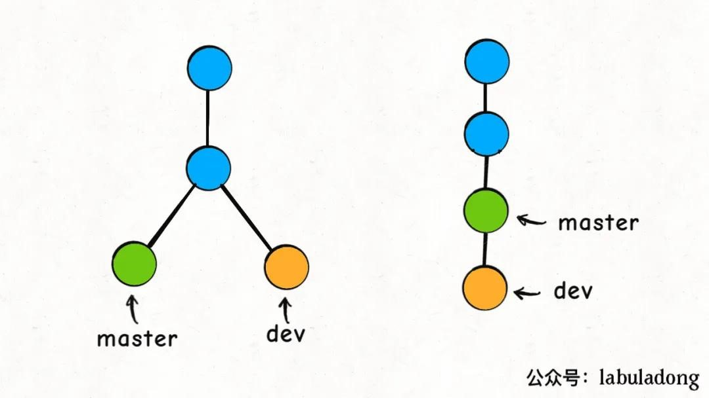
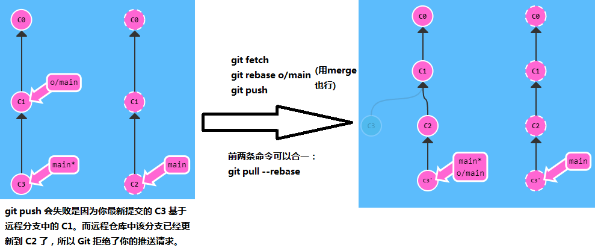

# git 远程

[Git：远程分支----git pull和git push命令用法介绍](https://blog.csdn.net/qq_42780289/article/details/97804091)

## 1 git pull

>git branch -r 查看远程分支
>
>远程分支 `origin/**` 是本地的分支，与远程仓库中的分支一一对应，只有当远程仓库中的分支发生了变化，通过fetch才能修改本地中远程分支的指向。

git pull 就是 git fetch 和 git merge 的缩写！
```
git init

git remote add origin git@github.com-qinzhu:614756773/huoguo.git
(git remote set-url origin 更改后的链接)
```

>pull需要当前分支与远程分支有联系才行。

pull远程的所有分支，直接使用git pull，后不加参数。

### 1.1 pull完整格式

取回远程主机的**指定分支**，再与本地的**指定分支**合并。

```
git pull <远程主机名> <远程分支名>:<本地分支名>
```

* <远程主机名>：origin

### 1.2 省略本地分支名

取回远程主机的**指定分支**，再与本地的**当前分支**合并。

```
git pull <远程主机名> <分支名>
```

* <分支名>：远程分支名

### 1.3 当前分支与远程分支存在多追踪关系

取回远程主机与当前分支**有追踪关系**的分支，再与本地的**当前分支**合并。

```
git pull <远程主机名>
```

### 1.4 当前分支只有一个追踪关系

```
git pull
```

### 1.5 拉取远程主机上被他人rebase操作然后强制推送的分支

有人推送了经过rebase操作的提交，并丢弃了你的本地开发所基于的一些提交，但是你push之后，那些被对方丢弃的提交又出现了，这是对方所不希望看到的。

所以在拉取合并时加上 `--rebase` 选项，git内部会自动检测，合并的结果会丢弃一些提交，符合预期。

```
git pull --rebase <远程主机名> <远程分支名>:<本地分支名>
```

### 1.6 在本地删除远程主机上已删除的对应分支

`git pull -p`

### 1.7 pull注意事项

git pull这个命令，我们经常会用，它默认是使用**merge**方式将远端别人的修改拉到本地；

如果带上上参数git pull -r，就会使用**rebase**的方式将远端修改拉到本地。

这二者最直观的区别就是：merge方式合并的分支会有很多「分叉」，而rebase方式合并的分支就是一条直线。

对于多人协作，merge方式并不好，多分支画面肯定杂乱，杂乱就意味着很容易出问题，所以一般来说，实际工作中更**推荐使用rebase**方式合并代码。



我站在dev分支，使用git rebase master，把dev接到master分支之上。Git 是这么做的：

首先，找到这两条分支的最近公共祖先LCA，然后从master节点开始，重演LCA到dev几个commit的修改，如果这些修改和LCA到master的commit有冲突，就会提示你手动解决冲突，最后的结果就是把dev的分支完全接到master上面。

## 2 git push

git push 不带任何参数时的行为与 Git 的一个名为 push.default 的配置有关。它的默认值取决于你正使用的 Git 的版本，在项目中进行推送之前，最好检查一下这个配置。

当push成功时，远程仓库的分支会更新，本地仓库中的远程分支origin/***也会更新。

### 2.1 push命令的完整格式

`git push <远程主机名> <本地分支名>:<远程分支名>`

### 2.2 省略远程分支名

```
git push <远程主机名> <分支名>
```

* <分支名>：本地分支名

将本地的指定分支推送到远程主机的同名分支上。注意如果远程主机不存在该同名分支，则会自动新建同名分支。

>通常加上-u，将远程分支与本地分支关联起来。

### 2.3 省略本地分支名

表示删除指定的远程分支，因为这等同于推送一个空的本地分支到远程分支

```
git push <远程主机名> :<远程分支名>

//Git v1.7.0 之后
git push <远程主机名> --delete <远程分支名>
```

### 2.4 当前分支与远程分支存在多追踪关系

将本地的当前分支推送到远程主机有追踪关系的对应分支上。

`git push <远程主机名>`


### 2.5 push注意事项之历史偏离

假设你周一克隆了一个仓库，然后开始研发某个新功能。到周五时，你新功能开发测试完毕，可以发布了。但是 —— 天啊！你的同事这周写了一堆代码，还改了许多你的功能中使用的 API，这些变动会导致你新开发的功能变得不可用。但是他们已经将那些提交推送到远程仓库了，因此你的工作就变成了基于项目旧版的代码，与远程仓库最新的代码不匹配了。

这种情况下,历史偏离有许多的不确定性，Git 是不会允许你 push 变更的。实际上它会强制你先合并远程最新的代码，然后才能分享你的工作。

即先pull再push。



