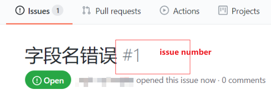

# git commit提交类型规范

https://blog.csdn.net/qq_41999617/article/details/110581321

## 1 统一格式

`git commit -m 'type(scope): 描述(#issue)'`

规范有3点:

1. type
2. scope
3. #issue

## 2 type

type|desc
:-|:-
init|初始化
feat|新特性
fix|修改问题
refactor|代码重构
docs|文档修改
style|代码格式修改, 注意不是 css 修改
test|测试用例修改
build|构建项目
chore|其他修改, 比如依赖管理
scope|commit 影响的范围, 比如route, component, utils, build...
subject|commit 的概述

## 3 scope

可以为提交类型添加一个围在圆括号内的作用域，以为其提供额外的上下文信息；

## 4 #issue

就是issues的编号。

## 5 举例

1. **issue**如下：
    

2. 解决issue后,进行**提交**：
    `git commit -m "fix(helloWorld):修改字段名(#1)"`

3. **查看github仓库**：
    