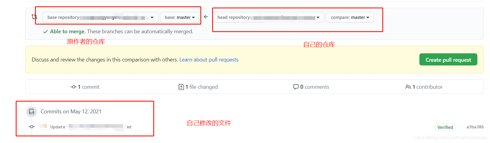

# 成为别人项目的贡献者

[一篇文章教会你拉取别人的GitHub代码，修改后提交成为贡献者！！！](https://blog.csdn.net/nanhuaibeian/article/details/116722359)

>注意，只是贡献者，不会在contribution显示。

例：我觉得别人的项目有个bug需要修复，或者我觉得可以更新个好玩的东西到别人项目里去，该怎么做呢？

## 1 Fork 别人的仓库

点击 fork 就可以把这个仓库加载到自己的 GitHub上，相当于复制了一份别人的仓库。

## 2 修改代码

1. 直接在github上进行修改
2. 或者clone到本地修改后再push到github

## 3 提交贡献

进入别人的github仓库的`pull requests`标签，并点击`new pull request`。

>一般会自动跳出`compare & pull request`

这里说白了就是提出**合并分支**的请求：表示想将自己仓库里某分支的`commits`合并(接)到别人仓库的某分支上

`compare`确认后，直接点击`create pull request`

## 4 成为别人项目的贡献者

原作者进入他的github仓库，同意我的分支合并请求后，我就成为贡献者啦。

>可以在contributors处看见我的头像。