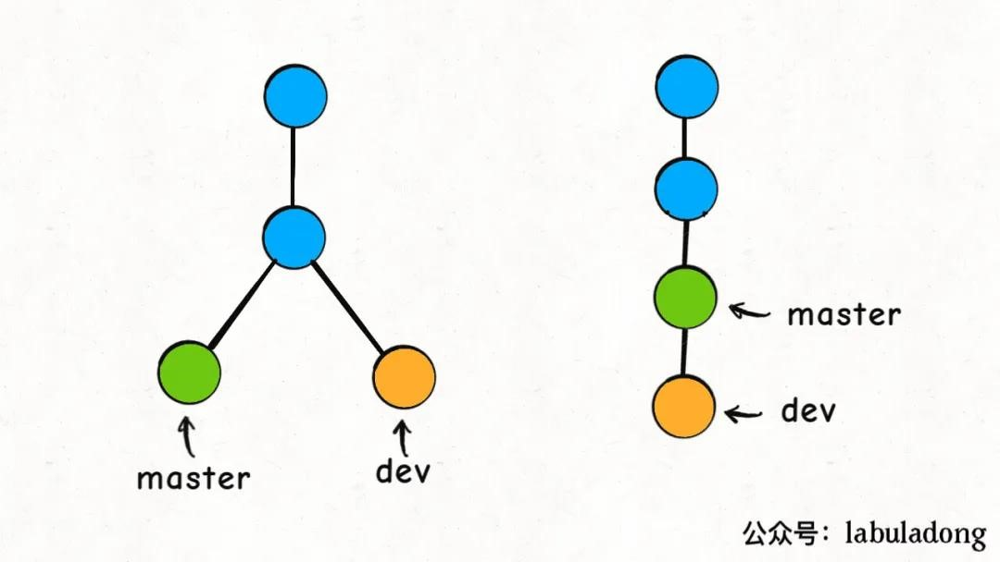

# git 远程


## git从远程pull

git pull 就是 git fetch 和 git merge 的缩写！
```
git init

git remote add origin git@github.com-qinzhu:614756773/huoguo.git
(git remote set-url origin 更改后的链接)
```

>pull需要当前分支与远程分支有联系才行。

pull远程的所有分支，直接使用git pull，后不加参数。

或者只pull某条远程的分支：
```
git pull origin master    pull远程master分支，默认将当前分支和远程master分支合并
```

git branch -r 查看远程分支
>远程分支是在本地的分支，与远程仓库中的分支一一对应，只有当远程仓库中的分支发生了变化，通过pull才能修改本地中远程分支的指向。
>
>fetch时下载的内容就在远程分支下

如果还想拉其他分支，需要pull

如，我还想pull远程的dev分支

不过在这之前，需要新建dev(或其他名字，最好和远程一样),再进入dev分支，再：
```
git pull origin dev
```
再查看git branch -r 会发现多了一个origin/dev的远程分支，

同时远程dev和本地dev合并

如果要push的话，可以用

git push --set-upstream origin dev将本地分支和远程分支彻底关联起来

## git pull注意事项
git pull这个命令，我们经常会用，它默认是使用**merge**方式将远端别人的修改拉到本地；

如果带上上参数git pull -r，就会使用**rebase**的方式将远端修改拉到本地。

这二者最直观的区别就是：merge方式合并的分支会有很多「分叉」，而rebase方式合并的分支就是一条直线。

对于多人协作，merge方式并不好，多分支画面肯定杂乱，杂乱就意味着很容易出问题，所以一般来说，实际工作中更**推荐使用rebase**方式合并代码。



我站在dev分支，使用git rebase master，把dev接到master分支之上。Git 是这么做的：

首先，找到这两条分支的最近公共祖先LCA，然后从master节点开始，重演LCA到dev几个commit的修改，如果这些修改和LCA到master的commit有冲突，就会提示你手动解决冲突，最后的结果就是把dev的分支完全接到master上面。

## push

git push 不带任何参数时的行为与 Git 的一个名为 push.default 的配置有关。它的默认值取决于你正使用的 Git 的版本，在项目中进行推送之前，最好检查一下这个配置。

当push成功时，远程仓库的分支会更新，本地仓库中的远程分支origin/***也会更新。

### 历史偏离

假设你周一克隆了一个仓库，然后开始研发某个新功能。到周五时，你新功能开发测试完毕，可以发布了。但是 —— 天啊！你的同事这周写了一堆代码，还改了许多你的功能中使用的 API，这些变动会导致你新开发的功能变得不可用。但是他们已经将那些提交推送到远程仓库了，因此你的工作就变成了基于项目旧版的代码，与远程仓库最新的代码不匹配了。

这种情况下,历史偏离有许多的不确定性，Git 是不会允许你 push 变更的。实际上它会强制你先合并远程最新的代码，然后才能分享你的工作。

即先pull再push。


